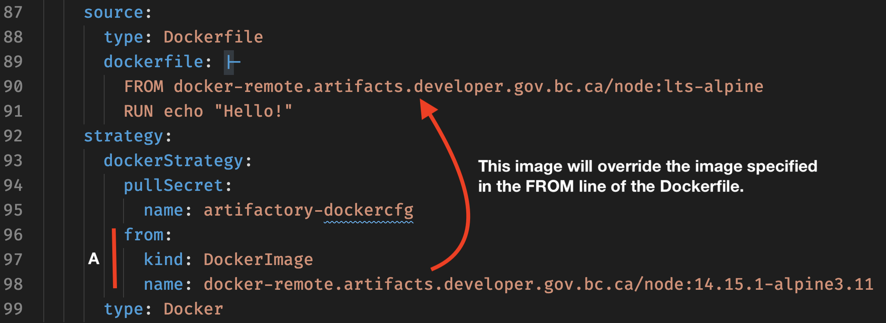
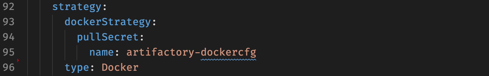
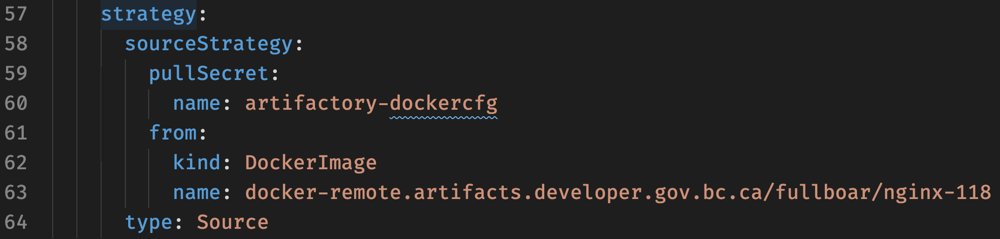
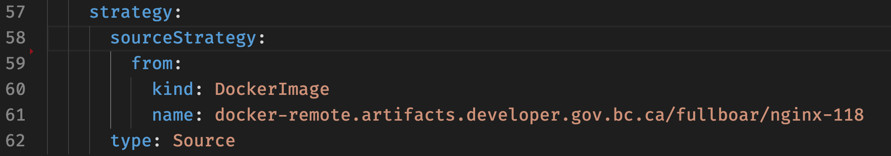

# TL;DR

This lab will build ones understanding and skills using remote images. You will learn how the different build strategies use remote images and how to leverage artifactory as a pull-through-cache to improve build times and reduce load on the bcgov network infrastructure.

# Using Remote Images in a Build

## Prerequisite(s)

On our OCP4 clusters and going forward you are automatically provisioned Artifactory credentials when your `tools` namespace is created. To find them, list your secrets and pick out the one with `artifactory` in the name:

You'll find one with the name:

```console
oc get secrets
```

Results in

```console
➜  openshift-workshop git:(master) ✗ oc get secrets
NAME                                 TYPE                                  DATA   AGE
artifactory-serviceaccount-default   kubernetes.io/basic-auth              2      6d22h
builder-dockercfg-vv8ft              kubernetes.io/dockercfg               1      6d22h
builder-token-jwr22                  kubernetes.io/service-account-token   4      6d22h
builder-token-zg7jv                  kubernetes.io/service-account-token   4      6d22h
default-dockercfg-ct5jj              kubernetes.io/dockercfg               1      6d22h
default-token-8fz6m                  kubernetes.io/service-account-token   4      6d22h
default-token-vt8kh                  kubernetes.io/service-account-token   4      6d22h
deployer-dockercfg-7c6vq             kubernetes.io/dockercfg               1      6d22h
deployer-token-gn7qs                 kubernetes.io/service-account-token   4      6d22h
deployer-token-q82hr                 kubernetes.io/service-account-token   4      6d22h
```

You can view the secret with additional `oc` commands or directs in the web UI. I generally don't print or paste secret directly in the terminal because they get stuck in the shell's history. Here are two command to bypass copy-and-paste and put them into env variables:

First the artifactory password:
```console
export AFPWD=$(oc get secret/artifactory-serviceaccount-default -o json | \
  jq '.data.password' | \
  tr -d "\"" | \
  base64 -d)
```

Then the artifactory username:
```console
export AFUSR=$(oc get secret/artifactory-serviceaccount-default -o json | \
  jq '.data.username' |  \
  tr -d "\"" | \
  base64 -d)
```

The penultimate 🧐 step is to create a specially formatted (docker config format) secret that "things" can use to pull images:

```console
oc create secret docker-registry artifactory-dockercfg \
  --docker-server=docker-remote.artifacts.developer.gov.bc.ca \
  --docker-username=$AFUSR \
  --docker-password=$AFPWD \
  --docker-email=unused
```

You can varry the name of the secret as you like, in this example the secret will be called `artifactory-dockercfg`:

```console
➜  openshift-workshop git:(master) ✗ oc get secrets
NAME                    TYPE                               DATA   AGE
artifactory-dockercfg   kubernetes.io/dockerconfigjson     1      3d5h
```

To see the contents of of your dockercfg secret try the following command:

```console
oc get secret/artifactory-dockercfg -o json | \
  jq '.data.".dockerconfigjson"' | \
  tr -d "\"" | \
  base64 -d
```

**Pro Tip** 🤓
 
 This sample uses `docker-remote` meaning that `docker.io` is the image repository Artifactory will cache. To use other repositories setup in Artifactory just change the first component of the URL.

| Repository           | Description |
| :------------------- | :---------- |
| docker-remote        | Caches for `docker.io` a.k.a Docker Hub. |
| redhat-docker-remote | Caches for the `registry.redhat.io` a.k.a RedHat Container Catalogue. |

And for the ultimate step, you may need to add some Network Security Policy (NSP) to allow builds (S2I specifically) to reach out to the internet. Included in this lab is some basic NSP for this purpose:

```console
oc process -f nsp-tools.yaml \
  -p NAMESPACE=$(oc project --short) | \
  oc create -f -
```

## Providing Credentials

While the types of builds you can do is outside the scope of this lab, the main point to take away is your build manifests will vary somewhat depending on what build strategy you choose. The two strategies capable of pulling images from remote repositories are `Docker` and `Source`. Regardless of which strategy you choose, if the remote repository requires authentication then you need to set up credentials the `builder` service account can use. Also, you must use one of them and it is recommended that you do **not** use both. Using both create inconsistencies in your build configuration making them more error prone and less portable.

### Use a `pullSecret`

The preferred technique to provide credentials to the `builder` service account is to use a `pullSecret`. It is the most declarative way to specify the secret, as one can understand where the credentials come from by reading the YAML. Also, this technique will work for both `Docker` and `Source` strategies.

### Link Your Secrets

Linking your secret to the built in `builder` service account is another acceptable way to provide credentials. To do this, use the `oc link` command as follows:

```console
oc secrets link builder artifactory-dockercfg --for=pull,mount
```

The `oc link` command will **only** work when used with `from` deceleration to specify a source image, but the `from` deceleration has different behavior depending on the build strategy.

## Build Strategies

The two different build strategies along with their unique behavior are outlined below.

### Docker Strategy

Use `type: Docker` to tell OCP to build an image using a Dockerfile; in the [sample](./build.yaml) included the Dockerfile is in-line for simplicity but its more common to keep this file in your repository.

As shown in the illustration below, the `from` deceleration will **override** the `FROM` line of your Dockerfile. If you don't want this behavior, don't include the `from` deceleration in your YAML. As mentioned above, the `oc link` technique will **not** work without a `from` deceleration.

This is what your YAML will look like when overriding the `FROM` in a Dockerfile; you can use it with either credentials technique:



If you are not using an image override, then you must include a `pullSecret` deceleration:



### S2I Strategy

Use `type: Source` to tell OCP to build an image using Source To Image (S2I). Unlike a Docker strategy, the `from` deceleration is required to tell OCP where find the source image. This means both the `pullSecret` or `oc link` technique to provide credentials to the `builder` service account will work.

This is what your YAML will look like with a `pullSecret`:



This is what your YAML will look like using `oc link`:



## The Lab 🧪🔬🥼

// TODO:(jl) Do we want some exercises ppl can work through to solidify this lesson?

 
<!-- oc start-build bc/hello-puller-dkr-build --follow -->

## Cleanup

Once you're done with this lab, you can remove all artifacts with:

```console
oc delete all -l "app=hello-puller"
```

and

```console
oc delete secret/artifactory-dockercfg
```
