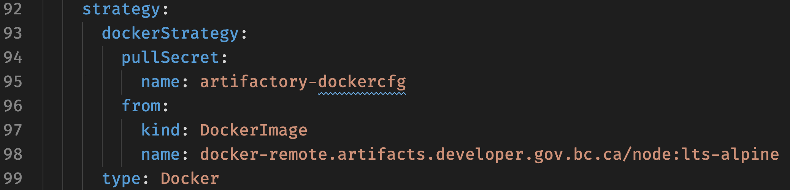
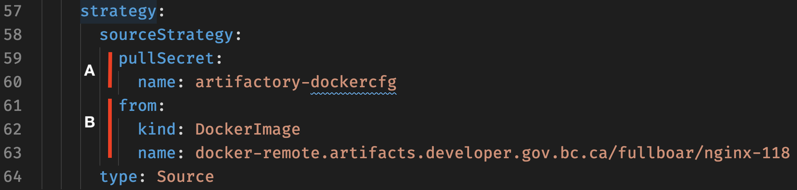

# TL;DR

This lab will build ones understanding and skills using remote images. You will learn how the different build strategies use remote images and how to leverage artifactory as a pull-through-cache to improve build times and reduce load on the bcgov network infrastructure.

# Using Remote Images in a Build

## Prerequisite(s)

On our OCP4 clusters and going forward you are automatically provisioned Artifactory credentials when your `tools` namespace is created. 

To find them, list your secrets and pick out the one with `artifactory` in the name:

You'll find one with the name:

```console
oc get secrets
```

Results in

```console
➜  openshift-workshop git:(master) ✗ oc get secrets
NAME                                 TYPE                                  DATA   AGE
artifactory-serviceaccount-default   kubernetes.io/basic-auth              2      6d22h
builder-dockercfg-vv8ft              kubernetes.io/dockercfg               1      6d22h
builder-token-jwr22                  kubernetes.io/service-account-token   4      6d22h
builder-token-zg7jv                  kubernetes.io/service-account-token   4      6d22h
default-dockercfg-ct5jj              kubernetes.io/dockercfg               1      6d22h
default-token-8fz6m                  kubernetes.io/service-account-token   4      6d22h
default-token-vt8kh                  kubernetes.io/service-account-token   4      6d22h
deployer-dockercfg-7c6vq             kubernetes.io/dockercfg               1      6d22h
deployer-token-gn7qs                 kubernetes.io/service-account-token   4      6d22h
deployer-token-q82hr                 kubernetes.io/service-account-token   4      6d22h
```

You can view the secret with additional `oc` commands or directs in the web UI. I generally don't print or paste secret directly in the terminal because they get stuck in the shell's history. Here are two command to bypass copy-and-paste and put them into env variables:

First the artifactory password:
```console
export AFPWD=$(oc get secret/artifactory-serviceaccount-default -o json | jq '.data.password' |  tr -d "\"" | base64 -d)
```

Then the artifactory username:
```console
export AFUSR=$(oc get secret/artifactory-serviceaccount-default -o json | jq '.data.username' |  tr -d "\"" | base64 -d)
```

The penultimate 🧐 step is to create a specially formatted (docker config format) secret that "things" can use to pull images:

```console
oc create secret docker-registry artifactory-dockercfg \
  --docker-server=docker-remote.artifacts.developer.gov.bc.ca \
  --docker-username=$AFUSR \
  --docker-password=$AFPWD \
  --docker-email=unused
```

You can varry the name of the secret as you like, in this example the secret will be called `artifactory-dockercfg`:

```console
➜  openshift-workshop git:(master) ✗ oc get secrets
NAME                    TYPE                               DATA   AGE
artifactory-dockercfg   kubernetes.io/dockerconfigjson     1      3d5h
```

**Pro Tip** 🤓
 
 This sample uses `docker-remote` meaning that `docker.io` is the image repository Artifactory will cache. To use other repositories setup in Artifactory just change the first component of the URL.

| Repository           | Description |
| :------------------- | :---------- |
| docker-remote        | Caches for `docker.io` a.k.a Docker Hub. |
| redhat-docker-remote | Caches for the `registry.redhat.io` a.k.a RedHat container catalogue. |


And for the ultimate step, you may need to add some Network Security Policy (NSP) to allow builds (S2I specifically) to reach out to the internet. Included in this lab is some basic NSP for this purpose:

```console
oc process -f nsp-tools.yaml \
  -p NAMESPACE=$(oc project --short) | \
  oc create -f -
```

## Build Strategies

While the types of builds you can do is outside the scope of this lab the main point to take away is your build manifests will vary somewhat depending on what strategy you choose.

### Docker Strategy

When using a docker strategy `type: Docker` in your **build** templates there are a few important points to note:

A) Using a `pullSecret` is a very common wak to specify the credentials to use. It is the most declarative way to specify the secret as one can understand where the credentials come from by reviewing the YAML.

B) When using `type: Docker` you are telling OCP to build using a Dockerfile; in my [sample](./build.yaml) I've embedded the Dockerfile in line for simplicity but its more common to keep it in your repository as a separate file.

In the image below the `from:` is used to override the `FROM` line of your Dockerfile. If you don't want this behavior, don't include the `from:` in your YAML.



While using a `pullSecret` as shown in the example above is preferred, you can also use this command to link the secret to the existing builder service account:

```console
oc secrets link builder artifactory-dockercfg --for=pull,mount
```

If you use this method you **do not** need include the `pullSecret` in your template.

**Pro Tip** 🤓

With respect to the image above:
- Use either `pullSecret` **OR** `oc secrets link` but not both;
- Use `from:` to override the `FROM` in a Dockerfile.
- If you **do not** use `from:`, then you **must** use a `pullSecret`.
- Skipping both a `pullSecret` and `from:` with always cause your build to fail if authentication is required to pull images.

### S2I Strategy

When using a docker strategy `type: Source` in your **build** templates there are a few important points to note:

A) Using a `pullSecret` is a very common wak to specify the credentials to use. It is the most declarative way to specify the secret as one can understand where the credentials come from by reviewing the YAML.

B) When using `type: Source` you are telling OCP to build using Source To Image (S2I). Unlike a Docker build, the `from:` is required for S2I builds to tell OCP where find the builder image.



While using a `pullSecret` as shown in the example above is preferred, you can also use this command to link the secret to the existing builder service account:

```console
oc secrets link builder artifactory-dockercfg --for=pull,mount
```

If you use this method you **do not** need include the `pullSecret` in your template.

**Pro Tip** 🤓

With respect to the image above:
- Use either `pullSecret` **OR** `oc secrets link` but not both.

## Cleanup

Once you're done with this lab, you can remove all artifacts with:

```console
oc delete all -l "app=hello-puller"
```

and

```console
oc delete secret/artifactory-dockercfg
```

-------------------

oc start-build bc/hello-puller-dkr-build --follow


oc get secret/artifactory-dockercfg -o json | jq '.data.".dockerconfigjson"' |tr -d "\"" | base64 -d

oc secrets link builder artifactory-dockercfg --for=pull
oc secrets link default artifactory-dockercfg --for=pull

now update docker.io to docker-remote.artifacts.developer.gov.bc.ca

```yaml
    strategy:
      dockerStrategy:
        pullSecret:
          name: artifactory-dockercfg
```


For a `type: Docker` build, you need either:
Line 32-33 OR Line 34-36 **with** the command:

```yaml
    source:
      type: Dockerfile
      dockerfile: |-
        FROM docker-remote.artifacts.developer.gov.bc.ca/node:lts-alpine
        RUN echo "Hello!"
    strategy:
      dockerStrategy:
        pullSecret:
          name: artifactory-dockercfg
        from: 
          kind: DockerImage
          name: docker-remote.artifacts.developer.gov.bc.ca/node:lts-alpine
      type: Docker
```
Also, just making notes here :) Skipping A and B will fail with or without the command.

```console
oc secrets link builder artifactory-dockercfg --for=pull,mount
```
or
```console
oc secrets link builder artifactory-dockercfg
```

For a `type: Source` you always need 55-57; line 53-54 without the command or
skip like 53-54 and use the command.

```yaml
      sourceStrategy:
        # pullSecret:
        #   name: artifactory-dockercfg
        from: 
          kind: DockerImage
          name: docker-remote.artifacts.developer.gov.bc.ca/fullboar/nginx-118
```